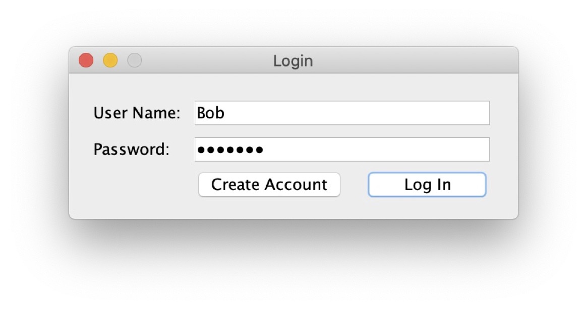
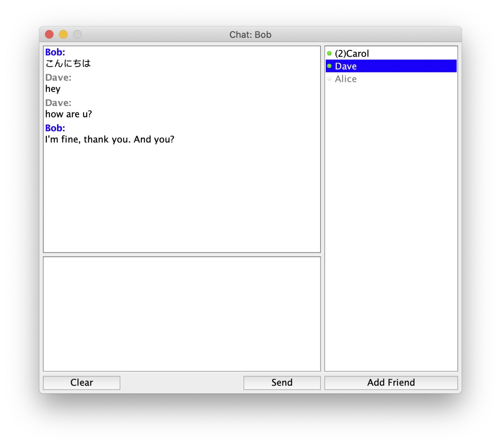

# Simple Chat in Java

A simple server-client chat software written in Java.
[presentation slide (Japanese)](./assets/presentation-slide.pdf)

**Note**: This is a small personal project for a network software development experiment class in my junior year in college. Due to security concerns, please don't use it for actual chat.

## Features

* GUI
* Account system
  * Register and login accounts
  * Add contacts
  * Check the online status of contacts
* Send and receive text messages (even if the receiver is offline)
* Save chat data locally

## Screenshots




## Run

* Server

  ```bash
  # Start a server before running clients
  $ cd ./ChatServer
  $ make
  $ make run
  ```

* Client

  ```bash
  # You may need to change IP/port of the server in 'ChatClient/Controller.java'
  $ cd ./ChatClient
  $ make
  $ make run
  ```
